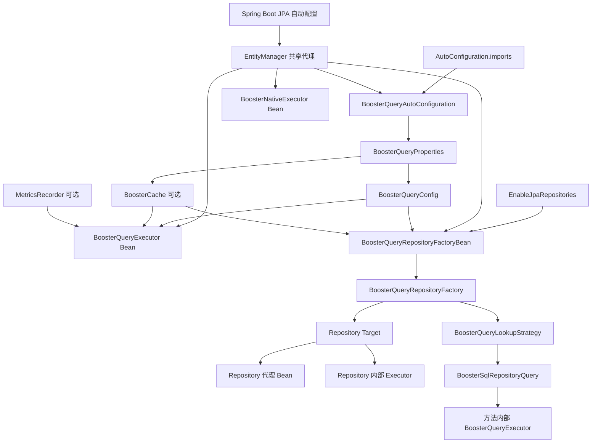

# BoosterQuery Bean 加载流程

本文从 Spring Boot 启动、Spring Data Repository 注册和查询执行三个阶段，梳理 BoosterQuery 中 Bean 与内部对象的创建关系。

> 说明：Spring Bean 的实际初始化顺序由依赖关系和 Spring 容器共同决定，不能简单理解为源码中 `@Bean` 方法的书写顺序。下文描述的是稳定的依赖顺序。

## 1. 总体结构

BoosterQuery 有两条相对独立的对象创建链：

1. **Spring Boot 自动配置链**：注册可由业务代码直接注入的基础设施 Bean。
2. **Spring Data Repository 链**：为每个 Repository 创建 FactoryBean、目标对象、查询对象和代理 Bean。

两条链共享 `EntityManager`、`BoosterQueryConfig` 和可选的 `BoosterCache`，但 Repository 内部不会复用自动配置创建的 Executor Bean。



## 2. Spring Boot 自动配置入口

Spring Boot 通过 [`AutoConfiguration.imports`](../src/main/resources/META-INF/spring/org.springframework.boot.autoconfigure.AutoConfiguration.imports) 发现 `BoosterQueryAutoConfiguration`：

```text
com.chaosguide.boosterquery.BoosterQueryAutoConfiguration
```

自动配置类的核心声明如下：

```java
@AutoConfiguration
@ConditionalOnBean(EntityManager.class)
@EnableConfigurationProperties(BoosterQueryProperties.class)
public class BoosterQueryAutoConfiguration {
}
```

因此，只有容器中已经存在 `EntityManager` 时，[`BoosterQueryAutoConfiguration`](../src/main/java/com/chaosguide/boosterquery/BoosterQueryAutoConfiguration.java) 才会生效。`EntityManagerFactory`、事务管理器和共享 `EntityManager` 代理由 Spring Boot JPA 自动配置负责创建，不属于 BoosterQuery 自身。

## 3. 自动配置创建的 Bean

### 3.1 配置属性

`@EnableConfigurationProperties` 注册 [`BoosterQueryProperties`](../src/main/java/com/chaosguide/boosterquery/config/BoosterQueryProperties.java)，并绑定 `booster.query.*`：

```yaml
booster:
  query:
    default-limit: 10000
    enable-auto-limit: true
    enable-sql-rewrite: true
    cache:
      enabled: false
      maximum-size: 1000
      expire-after-write: 3600000
```

随后，自动配置把属性复制到 [`BoosterQueryConfig`](../src/main/java/com/chaosguide/boosterquery/config/BoosterQueryConfig.java)。如果业务项目已经声明同类型 Bean，`@ConditionalOnMissingBean` 会使默认 Bean 退让。

### 3.2 执行器

自动配置会创建两个可直接注入的单例 Bean：

| Bean | 依赖 | 用途 |
|---|---|---|
| `BoosterNativeExecutor` | `EntityManager` | 直接执行原生 SQL，不做动态条件改写 |
| `BoosterQueryExecutor` | `EntityManager`、Config、可选 Cache、可选 Metrics | SQL 改写、自动限制、缓存和指标 |

例如业务 Service 可以直接注入：

```java
@Service
public class UserQueryService {

    private final BoosterQueryExecutor queryExecutor;

    public UserQueryService(BoosterQueryExecutor queryExecutor) {
        this.queryExecutor = queryExecutor;
    }
}
```

### 3.3 缓存

只有显式设置以下属性时才创建 [`CaffeineBoosterCache`](../src/main/java/com/chaosguide/boosterquery/cache/CaffeineBoosterCache.java)：

```yaml
booster:
  query:
    cache:
      enabled: true
```

缓存关闭时，`ObjectProvider<BoosterCache>.getIfAvailable()` 返回 `null`，Executor 按无缓存模式工作。如果业务项目提供了自定义 `BoosterCache` Bean，默认 Caffeine 实现不会创建。

### 3.4 指标记录器

只有 Micrometer 位于 classpath，并且容器中存在唯一可注入的 `MeterRegistry` 候选 Bean 时，
内部条件配置才会创建 `MicrometerMetricsRecorder`：

- 存在唯一 `MeterRegistry`，或者多个 Registry 中有一个 `@Primary`：创建 `MicrometerMetricsRecorder`。
- 不存在 `MeterRegistry`：不创建 `MetricsRecorder` Bean。
- 存在多个 Registry 且没有主候选：不创建 `MetricsRecorder` Bean。
- Micrometer 不在 classpath：不加载该条件配置。

未创建 `MetricsRecorder` Bean 时，自动配置创建的 `BoosterQueryExecutor` 会在构造过程中回退到
No-op recorder，而不是向 Spring 容器注册一个 No-op Bean。

## 4. 启用 Repository 增强

自动配置不会主动替换 Spring Data JPA 的 Repository FactoryBean。使用方需要显式指定：

```java
@SpringBootApplication
@EnableJpaRepositories(
    repositoryFactoryBeanClass = BoosterQueryRepositoryFactoryBean.class
)
public class MyApplication {
}
```

如果没有指定 `BoosterQueryRepositoryFactoryBean`，自动配置的 Executor Bean 仍然可以直接注入，但 `@BoosterQuery` 方法和 BoosterQuery 自定义 Repository 实现不会进入预期的创建链。

## 5. Repository Bean 创建过程

Spring Data 扫描 Repository 接口后，为每个接口注册一个 [`BoosterQueryRepositoryFactoryBean`](../src/main/java/com/chaosguide/boosterquery/BoosterQueryRepositoryFactoryBean.java)。其初始化过程如下：

```text
Repository 接口被扫描
  -> 创建 BoosterQueryRepositoryFactoryBean
  -> 父类注入 EntityManager
  -> 注入 ObjectProvider<BoosterQueryConfig>
  -> 注入 ObjectProvider<BoosterCache>
  -> createRepositoryFactory()
  -> 创建 BoosterQueryRepositoryFactory
  -> 创建 Repository Target
  -> 解析 Repository 查询方法
  -> 创建 Spring Data Repository 代理
  -> 将代理作为 Repository Bean 暴露给容器
```

`BoosterQueryRepositoryFactoryBean` 自身可以通过 `&repositoryBeanName` 取得；业务代码通常注入的是 FactoryBean 生产的 Repository 代理，而不是 FactoryBean 本身。

## 6. Repository Target 选择

[`BoosterQueryRepositoryFactory`](../src/main/java/com/chaosguide/boosterquery/repository/support/BoosterQueryRepositoryFactory.java) 根据接口继承关系选择目标实现：

| Repository 接口 | Target 实现 |
|---|---|
| 继承 `BoosterQueryRepository` | `BoosterQueryJpaRepository` |
| 其他 Repository | `BoosterNativeJpaRepository` |

`BoosterQueryJpaRepository` 继承 `BoosterNativeJpaRepository`，所以智能 Repository 同时支持：

- Spring Data JPA 标准方法；
- `native*` 原生查询方法；
- `booster*` 智能查询方法。

Target 由 Repository Factory 直接创建，不是单独注册的 Spring Bean。Spring Bean 是最外层的 Repository 代理。

## 7. `@BoosterQuery` 方法解析

Repository 初始化时，Factory 使用 [`BoosterQueryLookupStrategy`](../src/main/java/com/chaosguide/boosterquery/repository/query/BoosterQueryLookupStrategy.java) 包装 Spring Data 默认查询策略：

```text
Repository 方法
  -> 有 @BoosterQuery
       -> 创建 BoosterSqlRepositoryQuery
  -> 没有 @BoosterQuery
       -> 委托 Spring Data JPA 默认 QueryLookupStrategy
```

每个带 `@BoosterQuery` 的方法都会对应一个 [`BoosterSqlRepositoryQuery`](../src/main/java/com/chaosguide/boosterquery/repository/query/BoosterSqlRepositoryQuery.java)。它在创建时完成：

1. 读取注解配置；
2. 复制全局 `BoosterQueryConfig`；
3. 合并方法级 `enableRewrite`、`enableAutoLimit` 和 `autoLimit`；
4. 根据返回类型和 `@Modifying` 判断 Page、List、Single 或 Modify 执行类型；
5. 创建该方法使用的 `BoosterQueryExecutor`。

## 8. 三类 Executor 实例

项目中实际存在三类 Executor，需要特别区分：

| 来源 | 生命周期/数量 | 是否是 Spring Bean | 是否注入 Metrics |
|---|---|---|---|
| 自动配置 | 默认单例 | 是 | 是 |
| Repository Target 内部 | 通常每个 Repository Target 一组 | 否 | 否，使用 No-op |
| `BoosterSqlRepositoryQuery` 内部 | 每个 `@BoosterQuery` 方法一个 | 否 | 否，使用 No-op |

具体创建位置：

- [`BoosterNativeJpaRepository`](../src/main/java/com/chaosguide/boosterquery/repository/BoosterNativeJpaRepository.java) 内部创建 `BoosterNativeExecutor`；
- [`BoosterQueryJpaRepository`](../src/main/java/com/chaosguide/boosterquery/repository/BoosterQueryJpaRepository.java) 内部创建 `BoosterQueryExecutor`；
- `BoosterSqlRepositoryQuery` 内部为注解方法创建 `BoosterQueryExecutor`。

因此，Repository 调用不会经过自动配置创建的 Executor 单例。目前只有业务代码直接注入的 `BoosterQueryExecutor` Bean 会使用容器中的 `MetricsRecorder`。

## 9. 查询运行链路

```text
Repository 代理
  |-- JpaRepository 标准方法
  |     -> SimpleJpaRepository
  |
  |-- nativeQuery/nativeCount/nativeExecute
  |     -> BoosterNativeJpaRepository
  |     -> 内部 BoosterNativeExecutor
  |
  |-- boosterQuery/boosterCount/boosterExecute
  |     -> BoosterQueryJpaRepository
  |     -> 内部 BoosterQueryExecutor
  |
  `-- @BoosterQuery 方法
        -> BoosterSqlRepositoryQuery
        -> 方法内部 BoosterQueryExecutor
```

`BoosterQueryExecutor` 后续处理流程为：

```text
参数对象转 Map
  -> 识别 null、空白字符串和空集合参数
  -> 查询或写入 SQL 改写缓存
  -> BoosterSqlRewriter/JSqlParserRewriter 改写 SQL
  -> 生成 Count SQL、排序 SQL和自动限制
  -> ParameterBinder 绑定有效参数
  -> EntityManager 创建并执行 Native Query
  -> JpaResultMapper 映射 Entity/DTO/Record/Map/基础类型
```

## 10. Bean 与普通对象边界

| 类型 | 是否由 Spring 管理 |
|---|---|
| `BoosterQueryProperties` | 是 |
| `BoosterQueryConfig` | 是 |
| 自动配置创建的两个 Executor | 是 |
| `BoosterCache` | 可选 Bean |
| `MetricsRecorder` | 可选 Bean |
| Repository 代理 | 是 |
| `BoosterQueryRepositoryFactoryBean` | 是，作为 FactoryBean 注册 |
| `BoosterQueryRepositoryFactory` | 否，由 FactoryBean 创建 |
| Repository Target | 否，由 Repository Factory 创建 |
| Repository 内部 Executor | 否，由 Target 或 RepositoryQuery 创建 |
| `BoosterSqlRewriter`、`ParameterBinder`、`JpaResultMapper` 等工具类 | 否 |

## 11. 配置与实例共享特征

- `BoosterCache` 以同一个 Bean 引用传给 Repository Factory 和多个内部 Executor，因此缓存内容可以跨 Repository 实例共享。
- `BoosterQueryExecutor` 构造时会调用 `config.copy()`，保存配置快照。
- `@BoosterQuery` 方法会先复制并合并全局配置，Executor 构造时再复制一次。
- 应用启动完成后修改 `BoosterQueryConfig` Bean，不会自动更新已经创建的 Executor。
- 自动配置中的所有主要 Bean 都使用 `@ConditionalOnMissingBean`，业务项目可以覆盖默认配置、缓存或执行器实现。

## 12. 最终启动时序摘要

```text
1. Spring Boot 创建 DataSource、EntityManagerFactory 和 EntityManager 代理
2. 发现 BoosterQueryAutoConfiguration
3. 绑定 BoosterQueryProperties
4. 创建 BoosterQueryConfig
5. 按条件创建 BoosterCache 和 MetricsRecorder
6. 创建可直接注入的 BoosterNativeExecutor、BoosterQueryExecutor Bean
7. @EnableJpaRepositories 扫描 Repository 接口
8. 为每个接口创建 BoosterQueryRepositoryFactoryBean
9. FactoryBean 创建 BoosterQueryRepositoryFactory
10. Factory 创建 Repository Target 和查询解析对象
11. Spring Data 生成并暴露 Repository 代理 Bean
12. 业务 Bean 注入 Executor 单例或 Repository 代理
```
